# GlobeGo
**🌍 GlobeGo: Your AI-Powered Travel Ecosystem**

GlobeGo is a professional, modular Flutter application designed to redefine the travel experience through artificial intelligence and seamless social interaction. More than just a traditional planner, GlobeGo serves as your intelligent travel assistant-crafting custom routes based on your budget, synchronizing with your group in real-time, and providing deep analytical insights into your travel expenses.

* **Why GlobeGo?**
Unlike conventional travel applications, GlobeGo optimizes every moment of your journey through a data-driven and user-centric approach.
* **Tired of switching between 5 different apps?**
GlobeGo integrates planning, messaging, and expense tracking into a single, seamless workflow.
* **Is group coordination a nightmare?**
Our real-time synchronization ensures everyone stays on the same page-putting an end to those endless "Where are we going next?" messages.  
* **Worried about overspending?**
The AI engine constantly monitors your limits and suggests the most cost-effective options instantly.  
* **No internet while abroad?**
Access your tickets and itinerary anytime with the **Offline Digital Vault**, ensuring zero interruptions to your journey.  
* **Unsure of your next move?**
Discover AI-powered routes on the fly, perfectly tailored to your current mood and remaining budget.

* **You can visit our official website** for more information, updates, and resources: https://mehmetozdemirmo.github.io/Globego-Web/

---

## ✨ Key Features
* **Intelligent Deal Notifications:** Delivers real-time holiday opportunities and personalized offers based on user profiles and historical preferences.
* **Expense & Planning Analytics:** Provides deep budget analysis by categorizing travel expenses and presenting them through interactive data visualizations.
* **Smart Navigation & Timeline:** Features integrated location services and precise timeline management to orchestrate your travel itinerary minute-by-minute.
* **Digital Ticket Wallet:** A secure digital archive for all tickets and travel documents, ensuring instant access to both current and historical records.
  
---

## 🚀 What Makes GlobeGo Unique?
* **AI-Powered Package Curation:** Utilizing advanced AI algorithms to optimize accommodation and activity packages that perfectly align with the user's defined budget and preferences.
* **Social Planning Hub:** Dynamic in-app group creation that allows travelers to collaborate and synchronize travel itineraries with all participants in real-time.
* **QR Ecosystem (Upcoming Feature):** A dedicated QR code verification infrastructure providing exclusive discounts and seamless check-ins at GlobeGo partner locations.
  
---

## 🚀 Future Vision (Roadmap)
The evolution of GlobeGo is structured into 5 strategic phases, transforming it from a local planner into a comprehensive global travel assistant:

### ✅ Phase 1: Core Architecture & Cloud Integration (Completed)
* **Feature-First Architecture:** A sustainable infrastructure where every module (Auth, Chat, Planning) is independent, decoupled, and fully testable.
* **Firebase Integration:** Robust real-time data synchronization via Firestore and secure industry-standard authentication processes.

### 🎨 Phase 2: User Experience & Interface (UX/UI) (In Progress)
* **Dynamic Theme Management:** Personalized user experience featuring **Dark Mode** and system-aware automatic theme switching to reduce eye strain.
* **Modern Widget Library:** Fully customized travel timelines, interactive map panels, and fluid, high-performance animations.
* **Responsive Design:** Flexible and adaptive UI components engineered to perform flawlessly across various **iOS and Android** screen sizes.

### 🛠️ Phase 3: AI & Intelligent Algorithms (In Progress)
* **AI Budget Engine:** A machine learning model that matches users with high price-to-performance accommodation and activity packages based on predefined budget constraints.
* **Localization & Internationalization:** Implementation of a full localization infrastructure supporting **English, German, and French**.
* **Smart Notifications:** A dynamic push notification system that delivers personalized, deal-oriented alerts based on user behavior.

### 💳 Phase 4: Financial Ecosystem & QR Integration
* **QR Discount System:** A secure QR code verification infrastructure offering instant discounts at partner restaurants, hotels, and museums.
* **Split Bill Functionality:** Automated calculation and tracking of shared expenses among group participants for seamless financial management.

### 🌐 Phase 5: Offline Accessibility & Global Expansion
* **Offline Mode:** Continuous access to offline maps and digital tickets, ensuring reliability even in areas with limited connectivity.
* **Global API Integration:** Direct API-based booking integrations with international travel agencies and flight providers.

---

## 📸 Screenshots
<div align="center">
  
  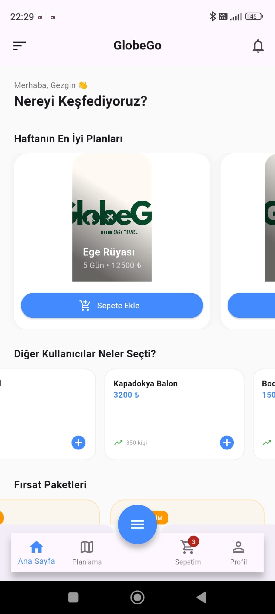
  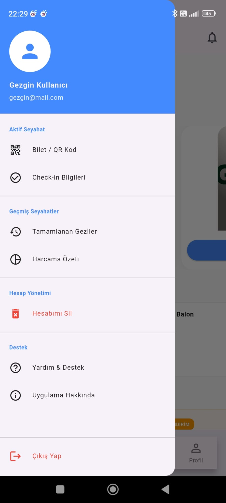
  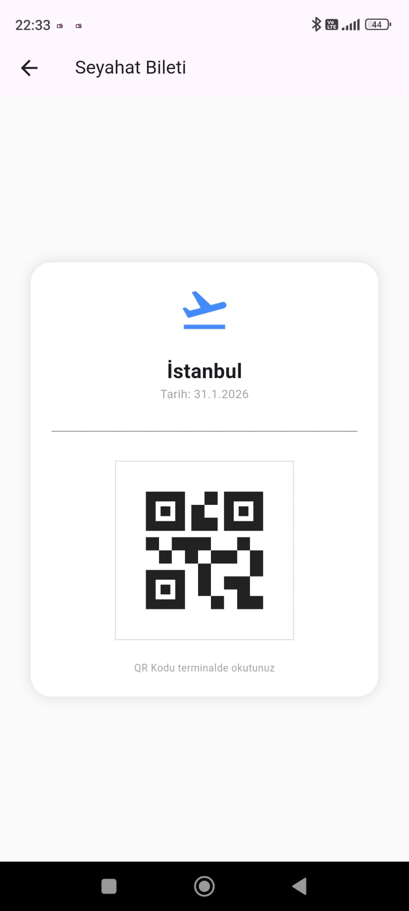
  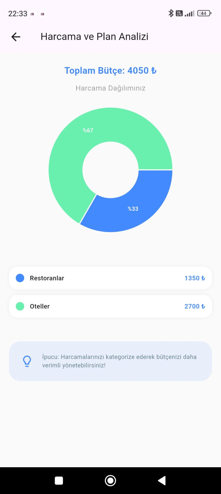
</div>

<div align="center">
  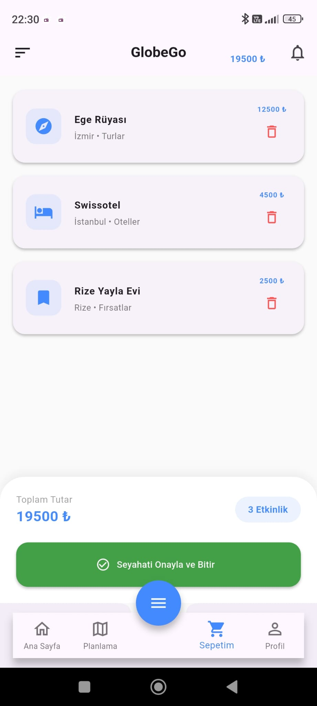
  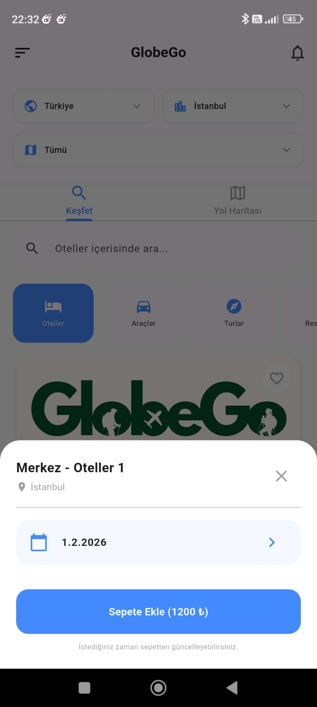
  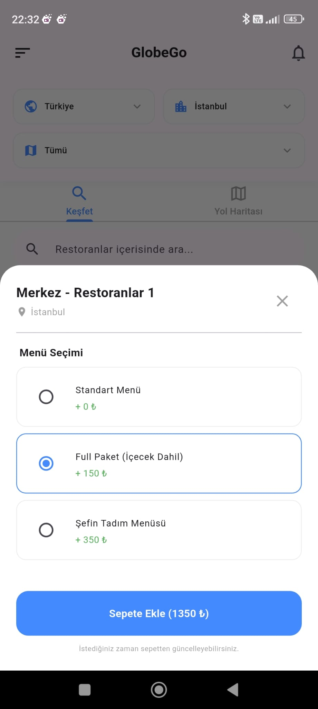
  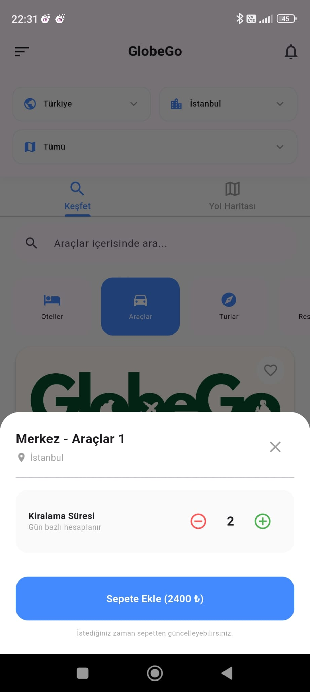
  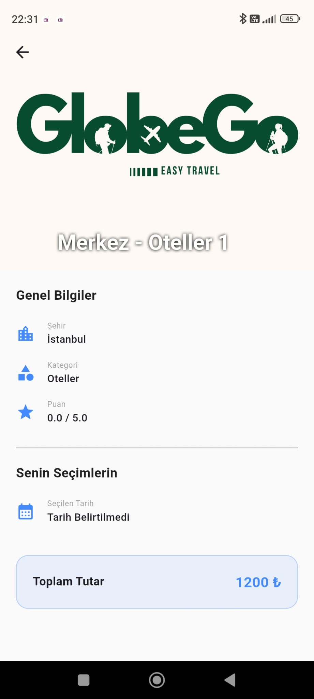
</div>

<div align="center">
  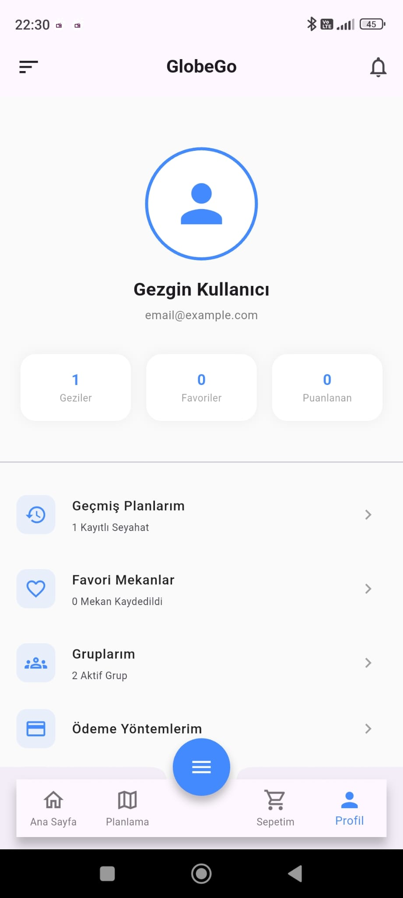
  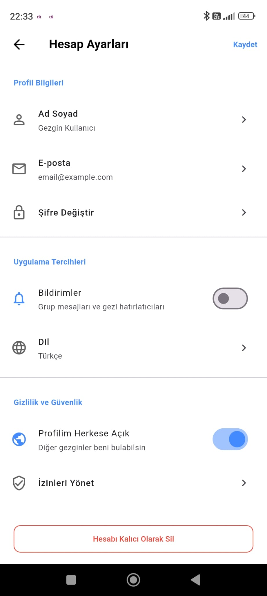
  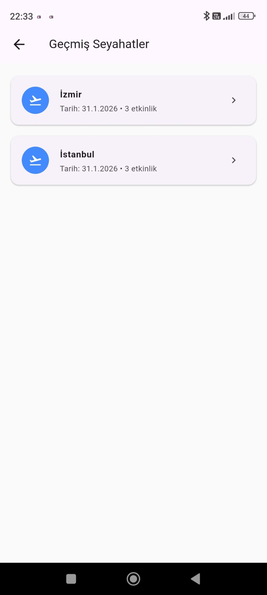
  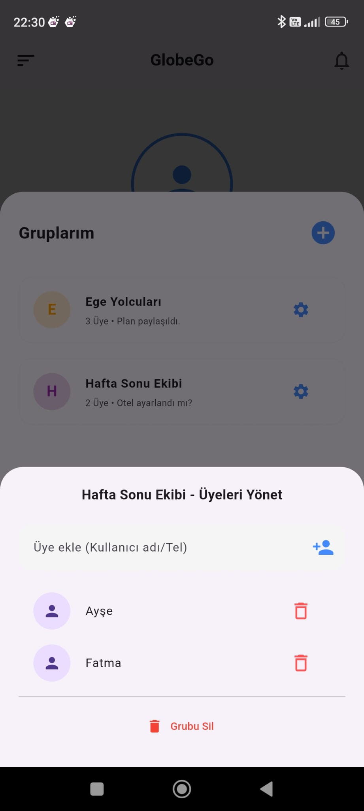
  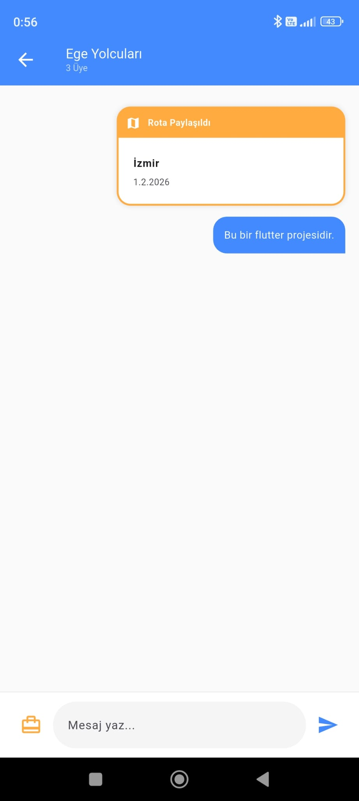
</div>

---

## 👤 User Stories: Why GlobeGo?

| User Profile | Core Objective | Key Advantage |
| :--- | :--- | :--- |
| 🎒 **Solo Traveler** | **AI-Powered Budgeting** | Maximum experience with efficient routes without exceeding financial limits. |
| 👥 **Group Leader** | **Real-time Syncing** | Live planning with the entire team, eliminating external messaging apps. |
| 💻 **Digital Nomad** | **Offline Ticket Vault** | Continuous access to documents and reservations without internet. |
| 🍕 **Food Explorer** | **QR Ecosystem & Deals** | Discovery of hidden local gems with location-based exclusive discounts. |
| ⏱️ **Meticulous Planner**| **Smart Timeline** | Zero time wasted with a precision-engineered, minute-by-minute itinerary. |
| 🎓 **Student Groups** | **Split Bill Tracking** | Automated expense splitting to end post-trip "debt calculation" stress. |
| 🏛️ **Culture Enthusiast**| **AI Package Curation** | Personalized museum and historical site suggestions based on interests. |

---

## 📬 Contact

For any inquiries or feedback, you can reach us at:

📧 *Email:* [globego.contact@gmail.com](mailto:globego.contact@gmail.com)

---

## 📂 Project Structure

```

lib/
├── features/                  
│   ├── auth/                  
│   │   ├── models/
│   │   │   └── user_model.dart
│   │   └── screens/
│   │       ├── login_screen.dart
│   │       └── register_screen.dart
│   ├── cart/              
│   │   └── screens/
│   │       └── cart_screen.dart
│   ├── chat/               
│   │   └── screens/
│   │       └── group_chat_screen.dart
│   ├── help/                   
│   │   └── screens/
│   │       └── support_screen.dart
│   ├── history/                
│   │   └── screens/
│   │       └── past_trips_screen.dart
│   ├── home/                   
│   │   ├── screens/
│   │   │   ├── expense_summary_screen.dart
│   │   │   ├── home_screen.dart
│   │   │   ├── past_trips_screen.dart  
│   │   │   └── ticket_screen.dart
│   │   └── widgets/
│   │       └── app_drawer.dart
│   ├── planning/               
│   │   ├── models/
│   │   │   └── cart_item.dart
│   │   ├── screens/
│   │   │   ├── details_screen.dart
│   │   │   ├── event_detail_page.dart
│   │   │   └── planning_screen.dart
│   │   ├── services/
│   │   │   └── location_service.dart
│   │   └── widgets/
│   │       ├── budget_widgets.dart
│   │       ├── location_panel.dart
│   │       ├── selection_sheet.dart
│   │       └── timeline_tile.dart
│   ├── profile/                
│   │   ├── models/
│   │   │   ├── group_model.dart
│   │   │   └── travel_group.dart
│   │   └── screens/
│   │       ├── account_settings_screen.dart
│   │       └── profile_screen.dart
│   ├── settings/              
│   │   └── screens/
│   │       └── settings_screen.dart
│   └── trips/                  
│       └── screens/
│           └── ticket_screen.dart
├── routes/                     
│   └── app_routes.dart
├── app.dart                    
└── main.dart                   

